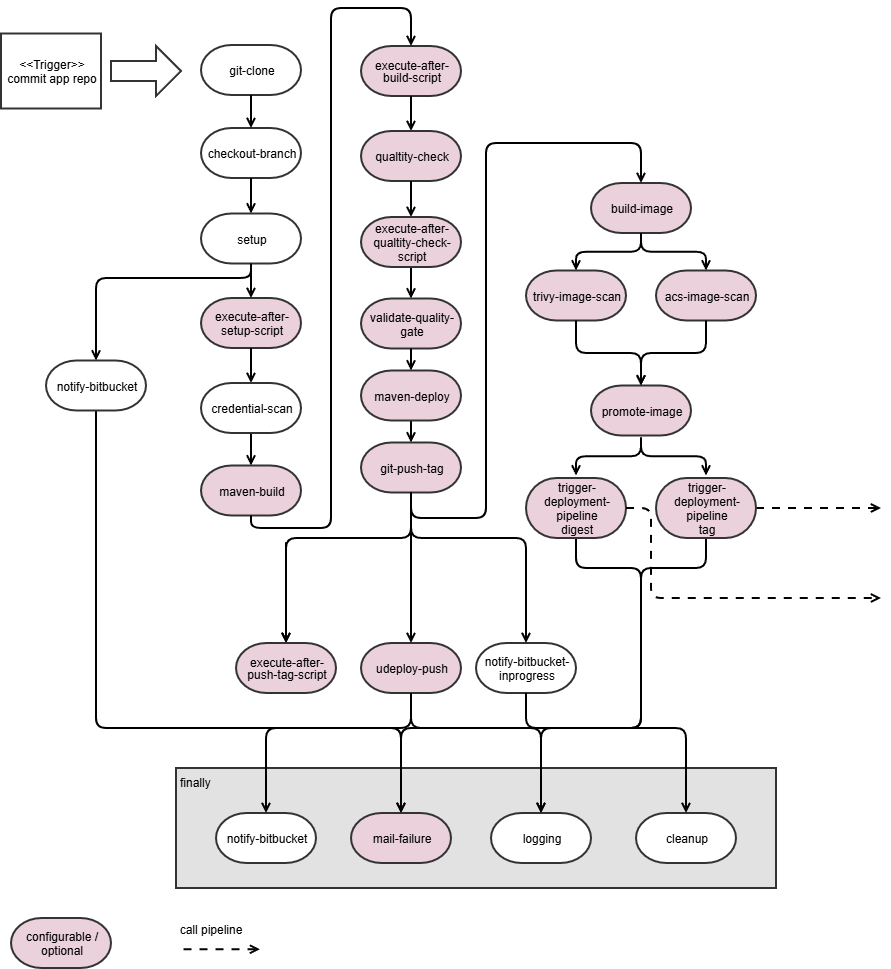

# Java build pipeline Helm Chart

## Introduction

This is a helm chart which serves as the template for builds of java applications using Tekton.
For more details, refer to the [documentation](./doc/java-build-pipeline.md).




## Integration of the pipeline in your projects

The pipeline chart will be created through Helm Chart dependency
```
dependencies:
  - name: java-build-pipeline
    version: "1.2.1"
    repository: https://nexus.bit.admin.ch/repository/bit-pipelines-helm-hosted
```

## Additional information

### Testing the chart locally during development of the chart

You can find scripts to support testing, installing, and publishing Helm charts for pipeline components in the [test folder](test).
For a detailed description, refer to the [TESTING.md](test/TESTING.md).

## Known limitations

no known limitations

## Source Code

* <https://bitbucket.bit.admin.ch/projects/CNP/repos/cd-pipeline/browse>

## Maintainers

| Name  | Email | Url                                                                                                                                                                                              |
|-------|-------|--------------------------------------------------------------------------------------------------------------------------------------------------------------------------------------------------|
| jeap  | -     | <https://teams.microsoft.com/l/channel/19%3A7202fca9d70c429fb2d145fd8f315877%40thread.tacv2/Ask_jEAP?groupId=4da9e6ac-20fc-493e-90e5-9fad7750406d&tenantId=6ae27add-8276-4a38-88c1-3a9c1f973767> | 
