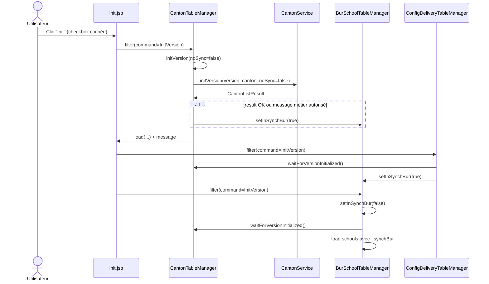
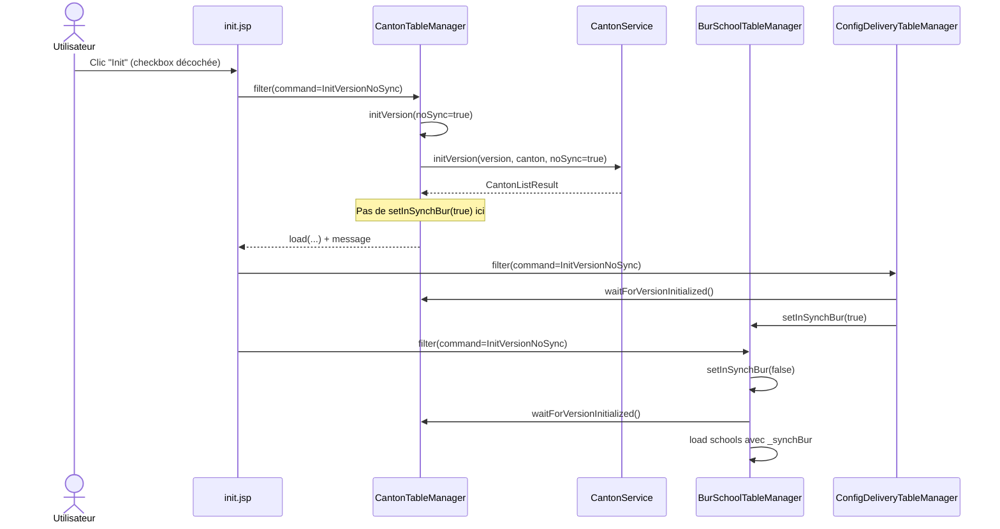

# SBAWEB — `init.jsp` vs `frontFolder/initialisation.html`

## 1) Comportement legacy (`init.jsp`) au clic sur **Init**

> Références code:  
> `sbaweb/src/.../CantonTableManager.java` (`filter`, `initVersion`)  
> `sbaweb/src/.../ConfigDeliveryTableManager.java` (`filter`)  
> `sbaweb/src/.../BurSchoolTableManager.java` (`filter`, `setInSynchBur`)  
> `web-commons/src/.../CallbackConstants.java`

### Cas A — checkbox **cochée** (`InitVersion`)

### Cas B — checkbox **décochée** (`InitVersionNoSync`)

---

## 2) Pourquoi `initialisation.html` (Angular) n’a pas le même comportement

Références:
- `frontFolder/src/app/shared/version-canton-filter/version-canton-filter.ts`
- `frontFolder/src/app/initialisation/initialisation.html`
- `frontFolder/src/app/initialisation/initialisation.ts`
- `frontFolder/src/app/services/initialisation/canton.ts`

### Écarts constatés

1. **L’événement `(initialiseVersion)` n’est jamais émis**  
   `VersionCantonFilter.initVersion()` appelle `applyFilter()` (donc `filterChanged.emit(...)`) mais ne fait pas `initialiseVersion.emit(...)`.  
   Conséquence: `Initialisation.initialiseYear(...)` n’est pas déclenché.

2. **La checkbox de synchro n’est pas cochée par défaut**  
   Le form initialise `syncSchool: false`, alors que le comportement demandé côté JSP part d’une case cochée (`checked`).

3. **Le service Angular `initVersion` ne suit pas le contrat réel**  
   `CantonService.initVersion(...)` traite la réponse comme un `Blob` CSV, alors que le backend `CantonRestController.initVersion` renvoie un `String` (message).

4. **Pas d’alignement explicite du flag de synchro BUR après init**  
   En Angular, la recherche des écoles utilise `withSync`, mais ce flag n’est pas piloté par le résultat de `init_version` comme dans le flux legacy.

---

## 3) Changements à faire pour que `initialisation.html` se comporte comme `init.jsp`

1. **Émettre correctement l’événement d’initialisation**
   - Dans `VersionCantonFilter.initVersion()`, émettre `initialiseVersion` avec le payload courant (version/canton/syncSchool).

2. **Mettre `syncSchool` à `true` par défaut**
   - Initialiser le form avec `syncSchool: true` pour reproduire la case cochée par défaut de `init.jsp`.

3. **Corriger le contrat API Angular de `init_version`**
   - Faire retourner un objet métier (ex.: `message`, `syncBur`) au lieu d’un flux CSV.
   - Adapter `CantonService.initVersion` pour renvoyer un `Observable` typé et non ouvrir un fichier.

4. **Chaîner le flux dans `Initialisation.initialiseYear`**
   - Appeler `initVersion`.
   - Attendre la réponse.
   - Mettre à jour l’état de synchro BUR (`withSync`) selon le résultat.
   - Recharger ensuite cantons/config/schools.

5. **Reproduire la logique métier legacy de synchro**
   - Côté backend, exposer explicitement le booléen “synchro BUR active” (la logique existe déjà dans `CantonTableManager.initVersion(...)`).
   - Côté front Angular, utiliser ce booléen pour piloter la table des écoles exactement comme le legacy.
